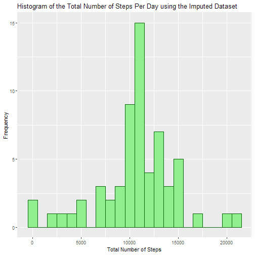
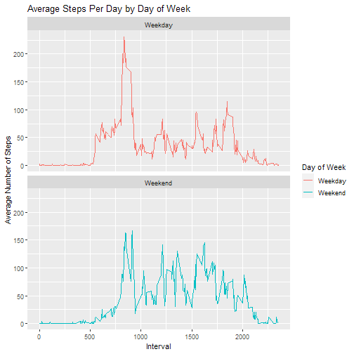

COURSE PROJECT 1
================
### REPRODUCIBLE RESEARCH
### Ivy Elaine Cadalzo


### 1. Loading and pre-processing the data:

```r
data <- read.csv("activity.csv", header = TRUE)

#data$date <- strptime(data$date, "%Y-%m-%d")
#allDates <- unique(data$date)
#str(data)
```


### 2. What is the mean total number of steps taken per day?  

    1. Calculate the total number of steps taken per day.

```r
stepsperday <- aggregate(data$steps, by=list(Dates=data$date), FUN=sum, na.rm=TRUE)
names(stepsperday)[2] <- "Sum"
```

    2. Make a histogram of the total number of steps taken each day.

```r
ggplot(stepsperday, aes(Sum)) +
  geom_histogram(fill="lightgreen",color="darkgreen",binwidth=1000) +
  labs(title="Histogram of the Total Number of Steps Per Day", x="Total Number of Steps", y="Frequency")
```


    3. Calculate and report the mean and median of the total number of steps taken per day.
    

```r
meansteps <- mean(stepsperday$Sum, na.rm=TRUE)
mediansteps <- median(stepsperday$Sum, na.rm=TRUE)
```

**The mean steps per day is 9354.2295082.**
**The median steps per day is 10395.**


### 3. What is the average daily activity pattern?

    1. Make a time series plot (i.e. type = "l") of the 5-minute interval (x-axis) and the average number of steps taken, averaged across all days (y-axis)

```r
meaninterval <- aggregate(data$steps, by=list(Intervals=data$interval), FUN=mean, na.rm=TRUE)
names(meaninterval)[2] <- "Mean"
ggplot(meaninterval, aes(x=Intervals, y=Mean)) + geom_line(color="blue", size=1) +
  labs(title="Average Steps Per 5-minute Interval", x="Interval", y="Average Steps")
```


    2. Which 5-minute interval, on average across all the days in the dataset, contains the maximum number of steps?

```r
maxinterval <- meaninterval[which.max(meaninterval$Mean),]
maxindex <- maxinterval$Intervals[1]
```

**The 5-minute interval with the maximum number of steps is 835.**
    
    
### 4. Imputing missing values

    1. Calculate and report the total number of missing values in the dataset (i.e. the total number of rows with NAs).

```r
missingval <- sum(is.na(data$steps))
```

**The total number of missing values in the dataset is 2304.**
    
    2. Devise a strategy for filling in all of the missing values in the dataset.

**The rounded average steps per 5-minute interval (the variable meaninterval in 3.2) will be used to fill in the missing values in the dataset.**

    3. Create a new dataset that is equal to the original dataset but with the missing data filled in.

```r
dataimpute <- data %>%
  mutate(
    steps = case_when(
      is.na(steps) ~ round(meaninterval$Mean[match(data$interval, meaninterval$Intervals)]),
      TRUE~as.numeric(steps)
    )
  )
```

**A new dataset called *dataimpute* was created during this step.**

    4. Make a histogram of the total number of steps taken each day and calculate and report the mean and median total number of steps taken per day.

```r
imputedstepsperday <- aggregate(dataimpute$steps, by=list(Dates=dataimpute$date), FUN=sum, na.rm=TRUE)
names(imputedstepsperday)[2] <- "Sum"

ggplot(imputedstepsperday, aes(Sum)) +
  geom_histogram(fill="lightgreen",color="darkgreen",binwidth=1000) +
  labs(title="Histogram of the Total Number of Steps Per Day using the Imputed Dataset", x="Total Number of Steps", y="Frequency")
```



```r
imputedmeansteps <- mean(imputedstepsperday$Sum, na.rm=TRUE)
imputedmediansteps <- median(imputedstepsperday$Sum, na.rm=TRUE)

diffmean <- abs(meansteps-imputedmeansteps)
diffmedian <- abs(mediansteps-imputedmediansteps)
```

**The new mean steps per day is 1.0765639 &times; 10<sup>4</sup>.**
**The new median steps per day is 1.0762 &times; 10<sup>4</sup>.**
    
**Using the imputed dataset, the new mean steps per day (1.0765639 &times; 10<sup>4</sup>) became closer to the new median steps per (1.0762 &times; 10<sup>4</sup>). The imputation resulted in the increase of the mean and median values:**
    
**- Difference between the two mean values: 1411.4098361**
**- Difference between the two median values: 367**

**Based on the histogram, the frequency of days with a total number of steps equal to zero (0) has decreased significantly.**

### 5. Are there differences in activity patterns between weekdays and weekends?

    1. Create a new factor variable in the dataset with two levels - "weekday" and "weekend" indicating whether a given date is a weekday or weekend.

```r
dayofweek <- dataimpute %>%
  mutate(
    date = ymd(date),
    weekday_weekend = case_when(
      wday(date) %in% 2:6 ~ "Weekday",
      wday(date) %in% c(1,7) ~ "Weekend"
    )
  )
head(dayofweek)
```

```
##   steps       date interval weekday_weekend
## 1     2 2012-10-01        0         Weekday
## 2     0 2012-10-01        5         Weekday
## 3     0 2012-10-01       10         Weekday
## 4     0 2012-10-01       15         Weekday
## 5     0 2012-10-01       20         Weekday
## 6     2 2012-10-01       25         Weekday
```

**The variable *weekday_weekend* indicates the day of the week (either a weekday or a weekend).**

    2. Make a panel plot containing a time series plot (i.e. type="l") of the 5-minute interval (x-axis) and the average number of steps taken, averaged across all weekday days or weekend days (y-axis).

```r
dayofweekmean <- aggregate(steps~interval+weekday_weekend,data=dayofweek, mean)
ggplot(dayofweekmean, aes(x=interval,y=steps, color=weekday_weekend)) +
  geom_line() +
  labs(title="Average Steps Per Day by Day of Week", x="Interval", y="Average Number of Steps") +
  facet_wrap(~weekday_weekend, ncol=1, nrow=2) +
  scale_colour_discrete(name="Day of Week")
```


